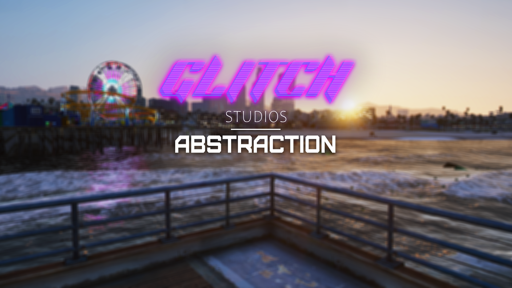

# 💖 Glitch Abstraction

## Glitch Abstraction  

<figure><figcaption></figcaption></figure>

Github Resource: [https://github.com/Gl1tchStudios/glitch-abstraction](https://github.com/Gl1tchStudios/glitch-abstraction)

### Overview

Glitch Abstraction is a comprehensive abstraction layer for FiveM that seamlessly integrates multiple frameworks, inventory systems, UIs, targeting systems, and more under one unified API. This library allows developers to write code once that works across different frameworks and resource systems without modification.

### ✨ Features

#### Supported Frameworks

* **ESX Legacy** - Full support for ESX Legacy framework functions
* **QBCore** - Complete integration with QBCore framework
* **QBox** - Compatible with QBox framework systems

#### Supported Inventory Systems

* **ox\_inventory** - Full support for ox\_inventory functions and features
* **qb-inventory** - Complete integration with QBCore's inventory system
* **ESX inventory** - Compatible with ESX's default inventory

#### Supported UI Systems

* **ox\_lib** - Comprehensive support for ox\_lib UI components including:
  * Input dialogs
  * Context menus
  * Navigation menus
  * Radial menus
  * Progress indicators
  * Text UI
  * Skill checks
  * Alert dialogs
* **QBCore** - Integration with QBCore UI elements
* **ESX** - Support for ESX UI components

#### Supported Notifications Systems

* **ox\_lib** - Full support for ox\_lib notifications with multiple styles
* **QBCore** - Integration with QBCore notification system
* **ESX** - Support for ESX notifications
* **Glitch Notifications** - Support for Glitch Notifications

#### Supported Target Systems

* **ox\_target** - Complete integration with ox\_target
* **qb-target** - Support for QBCore's targeting system
* **bt-target** - Compatible with bt-target functionality

#### Supported Door Lock Systems

* **ox\_doorlock** - Full support for ox\_doorlock functions
* **qb-doorlock** - Integration with QBCore's door lock system
* **esx\_doorlock** - Support for ESX door lock functionality

#### Supported Progression Systems

* **pickle\_xp** - Complete integration with pickle\_xp for XP and leveling systems

#### Additional Features

* **Cutscene System** - Tools for managing GTA cutscenes
* **Scaleform System** - Utilities for working with GTA scaleforms

### 📜 Credits

Developed by Glitch Studios\
Special thanks to the FiveM community for support and inspiration.

### 📄 License

This project is licensed under the GNU General Public License v3.0 - see the LICENSE file for details.

For support or inquiries, please join and open a ticket in our [Discord Server](https://discord.gg/glitchstudios).
