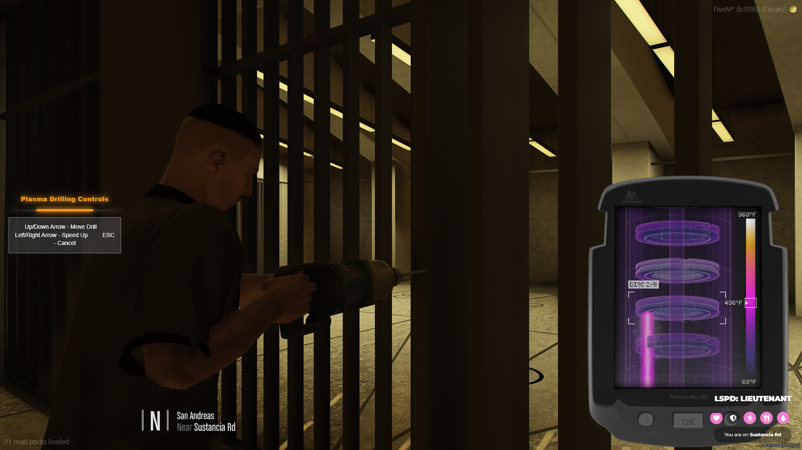
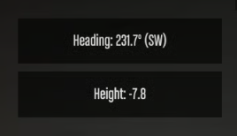

# Examples

Below are quick usage examples for each minigame included in **Glitch Minigames**:

***

<figure><figcaption></figcaption></figure>

#### 🔐 Firewall Pulse

```lua
local success = exports['glitch-minigames']:StartFirewallPulse()
    if success then
        print("You completed the hack!")
    else
        print("You failed the hack")
    end
end)

-- Custom Parameters
local success = exports['glitch-minigames']:StartFirewallPulse(3, 2, 10, 8, 30, 120, 40)
```

***

<figure><figcaption></figcaption></figure>

🧠 Backdoor Sequence

```lua
local success = exports['glitch-minigames']:StartBackdoorSequence(3, 20, 20, 3, 2.0, 3, 6, {'W', 'A', 'S', 'D'}, 'W, A, S, D only')
if success then
    print("Sequence hack successful!")
else
    print("Sequence hack failed!")
end
```

***

<figure><figcaption></figcaption></figure>

#### 🎵 Circuit Rhythm

```lua
local success = exports['glitch-minigames']:StartCircuitRhythm()
    if success then
        print("Rhythm game completed!")
    else
        print("Rhythm game failed")
    end
end)

-- Custom Settings
local success = exports['glitch-minigames']:StartCircuitRhythm(4, {'A','S','D','F'}, 150, 800, 15, "normal", 5, 3)
```

***

<figure><figcaption></figcaption></figure>

#### ⚡ Surge Override

```lua
local success = exports['glitch-minigames']:StartSurgeOverride()
    if success then
        print("Surge Override successful!")
    else
        print("Surge Override failed")
    end
end)

-- Random Key Mode
local success = exports['glitch-minigames']:StartSurgeOverride({'E', 'F'}, 30, 2)
```

***

<figure><figcaption></figcaption></figure>

#### 🔌 Circuit Breaker

```lua
local success = exports['glitch-minigames']:StartCircuitBreaker(2, 1, 1000, 5000, 5000, 0 10000, 3000, 30000)
if success then
    print("Circuit successfully breached!")
else
    print("Circuit breach failed!")
end
```

***

<figure><figcaption></figcaption></figure>

#### 📊 Data Crack

```lua
local success = exports['glitch-minigames']:StartDataCrack(3)
if success then
    print("Data successfully cracked!")
else
    print("Failed to crack data!")
end
```

***

<figure><figcaption></figcaption></figure>

#### 🔠 Brute Force

```lua
local success = exports['glitch-minigames']:StartBruteForce(5)
if success then
    print("Password successfully cracked!")
else
    print("Failed to crack password!")
end
```

***

### 📚 Usage Examples

<figure><figcaption></figcaption></figure>

#### 🔥 Normal Drilling

```lua
local success = exports['glitch-minigames']:StartDrilling()
if success then
    print("Successfully completed drilling!")
else
    print("Drilling failed!")
end
```

***

<figure><figcaption></figcaption></figure>

#### 🔢 VAR Hack

```lua
local success = exports['glitch-minigames']:StartVarHack(5, 5)
if success then
    print("VAR hack successful!")
else
    print("VAR hack failed!")
end
```

***

<figure><figcaption></figcaption></figure>

#### 🔥 Plasma Drill

```lua
local success = exports['glitch-minigames']:StartPlasmaDrilling()
if success then
    print("Successfully completed plasma drilling!")
else
    print("Plasma drilling failed!")
end

-- Custom Difficulty
local success = exports['glitch-minigames']:StartPlasmaDrilling(7)
if success then
    print("Completed difficult plasma drilling!")
else
    print("Failed difficult plasma drilling!")
end
```

***


All Minigames below here are apart of the Glitch Minigames v2 Update


<figure><figcaption></figcaption></figure>

### 🧠 Memory Game

```lua
local success = exports['glitch-minigames']:StartMemoryGame()
    if success then
        print("Memory game completed!")
    else
        print("Memory game failed")
    end
end)

-- Custom Settings
local success = exports['glitch-minigames']:StartMemoryGame(5, 8, 3, 3000, 3)
-- Parameters: gridSize, squareCount, rounds, showTime, maxWrongPresses
-- Defaults: 5, 8, 3, 3000, 3
```

***

<figure><figcaption></figcaption></figure>

### 📝 Sequence Memory Game

```lua
local success = exports['glitch-minigames']:StartSequenceMemoryGame()
    if success then
        print("Sequence memory game completed!")
    else
        print("Sequence memory game failed")
    end
end)

-- Custom Settings
local success = exports['glitch-minigames']:StartSequenceMemoryGame(4, 5, 3, 1000, 300)
-- Parameters: gridSize, maxRounds, maxWrongPresses, showTime, delayBetween
-- Defaults: 4, 5, 3, 1000, 300
```

***

<figure><figcaption></figcaption></figure>

### 💬 Verbal Memory Game

```lua
local success = exports['glitch-minigames']:StartVerbalMemoryGame()
    if success then
        print("Verbal memory game completed!")
    else
        print("Verbal memory game failed")
    end
end)

-- Custom Settings
local success = exports['glitch-minigames']:StartVerbalMemoryGame(3, 50, 5000)
-- Parameters: maxStrikes, wordsToShow, wordDuration
-- Defaults: 3, 50, 5000
```

***

<figure><figcaption></figcaption></figure>

### 🔢 Numbered Sequence Game

```lua
local success = exports['glitch-minigames']:StartNumberedSequenceGame()
    if success then
        print("Numbered sequence game completed!")
    else
        print("Numbered sequence game failed")
    end
end)

-- Custom Settings
local success = exports['glitch-minigames']:StartNumberedSequenceGame(4, 6, 3, 4000, 10000, 3)
-- Parameters: gridSize, sequenceLength, rounds, showTime, guessTime, maxWrongPresses
-- Defaults: 4, 6, 3, 4000, 10000, 3
```

***

<figure><figcaption></figcaption></figure>

### 🔍 Symbol Search Game

```lua
local success = exports['glitch-minigames']:StartSymbolSearchGame()
    if success then
        print("Symbol search game completed!")
    else
        print("Symbol search game failed")
    end
end)

-- Custom Settings
local success = exports['glitch-minigames']:StartSymbolSearchGame(8, 1000, 30000, 1, 1, "symbols")
-- Parameters: gridSize, shiftInterval, timeLimit, minKeyLength, maxKeyLength, symbolType
-- Defaults: 8, 1000, 30000, 1, 1, "symbols"
```

***

<figure><figcaption></figcaption></figure>

### 🚰 Pipe Pressure Game

```lua
local success = exports['glitch-minigames']:StartPipePressureGame()
    if success then
        print("Pipe pressure game completed!")
    else
        print("Pipe pressure game failed")
    end
end)

-- Custom Settings
local success = exports['glitch-minigames']:StartPipePressureGame(6, 30000)
-- Parameters: gridSize, timeLimit
-- Defaults: 6, 30000
```

***

<figure><figcaption></figcaption></figure>

### 🃏 Pairs Game

```lua
local success = exports['glitch-minigames']:StartPairsGame()
    if success then
        print("Pairs game completed!")
    else
        print("Pairs game failed")
    end
end)

-- Custom Settings
local success = exports['glitch-minigames']:StartPairsGame(4, 120000, 0)
-- Parameters: gridSize, timeLimit, maxAttempts
-- Defaults: 4, 120000, 0 (0 = unlimited)
```

***

<figure><figcaption></figcaption></figure>

### 🎨 Memory Colors Game

```lua
local success = exports['glitch-minigames']:StartMemoryColorsGame()
    if success then
        print("Memory colors game completed!")
    else
        print("Memory colors game failed")
    end
end)

-- Custom Settings
local success = exports['glitch-minigames']:StartMemoryColorsGame(5, 5000, 10000, 3)
-- Parameters: gridSize, memorizeTime, answerTime, rounds
-- Defaults: 5, 5000, 10000, 3
```

***

<figure><figcaption></figcaption></figure>

### 🪢 Untangle Game

```lua
local success = exports['glitch-minigames']:StartUntangleGame()
    if success then
        print("Untangle game completed!")
    else
        print("Untangle game failed")
    end
end)

-- Custom Settings
local success = exports['glitch-minigames']:StartUntangleGame(8, 60000)
-- Parameters: nodeCount, timeLimit
-- Defaults: 8, 60000
```

***

<figure><figcaption></figcaption></figure>

### 👆 Fingerprint Game

```lua
local success = exports['glitch-minigames']:StartFingerprintGame()
    if success then
        print("Fingerprint game completed!")
    else
        print("Fingerprint game failed")
    end
end)

-- Custom Settings
local success = exports['glitch-minigames']:StartFingerprintGame(30000, true, true)
-- Parameters: timeLimit, showAlignedCount, showCorrectIndicator
-- Defaults: 30000, true, true
```

***

<figure><figcaption></figcaption></figure>

### 🔐 Code Crack Game

```lua
local success = exports['glitch-minigames']:StartCodeCrackGame()
    if success then
        print("Code crack game completed!")
    else
        print("Code crack game failed")
    end
end)

-- Custom Settings
local success = exports['glitch-minigames']:StartCodeCrackGame(60000, 4, 6)
-- Parameters: timeLimit, digitCount, maxAttempts
-- Defaults: 60000, 4, 6
```

***

<figure><figcaption></figcaption></figure>

### 📝 Word Crack Game

```lua
local success = exports['glitch-minigames']:StartWordCrackGame()
    if success then
        print("Word crack game completed!")
    else
        print("Word crack game failed")
    end
end)

-- Custom Settings
local success = exports['glitch-minigames']:StartWordCrackGame(120000, 5, 6)
-- Parameters: timeLimit, wordLength, maxAttempts
-- Defaults: 120000, 5, 6
```

***

<figure><figcaption></figcaption></figure>

### ⚖️ Balance Game

```lua
local success = exports['glitch-minigames']:StartBalanceGame()
    if success then
        print("Balance game completed!")
    else
        print("Balance game failed")
    end
end)

-- Custom Settings
local success = exports['glitch-minigames']:StartBalanceGame(10000, 3, 8, 30, 25, 2, 1000)
-- Parameters: timeLimit, driftSpeed, sensitivity, greenZoneWidth, yellowZoneWidth, driftRandomness, maxDangerTime
-- Defaults: 10000, 3, 8, 30, 25, 2, 1000
```

***

<figure><figcaption></figcaption></figure>

### 🎯 Aim Test Game

```lua
local success = exports['glitch-minigames']:StartAimTestGame()
    if success then
        print("Aim test game completed!")
    else
        print("Aim test game failed")
    end
end)

-- Custom Settings
local success = exports['glitch-minigames']:StartAimTestGame(30000, 10, 1500, 60, true, 5, 0)
-- Parameters: timeLimit, targetsToHit, targetLifetime, targetSize, shrinkTarget, maxMisses, timePenalty
-- Defaults: 30000, 10, 1500, 60, true, 5, 0
```

***

<figure><figcaption></figcaption></figure>

### ⭕ Circle Click Game

```lua
local success = exports['glitch-minigames']:StartCircleClickGame()
    if success then
        print("Circle click game completed!")
    else
        print("Circle click game failed")
    end
end)

-- Custom Settings
local success = exports['glitch-minigames']:StartCircleClickGame(5, 2, 45, 3, 0.15, true, {'W', 'A', 'S', 'D'})
-- Parameters: rounds, rotationSpeed, targetZoneSize, maxFailures, speedIncrease, randomizeDirection, keys
-- Defaults: 5, 2, 45, 3, 0.15, true, {'W', 'A', 'S', 'D'}
```

***

<figure><figcaption></figcaption></figure>

### 🔓 Lockpick Game

```lua
local success = exports['glitch-minigames']:StartLockpickGame()
    if success then
        print("Lockpick game completed!")
    else
        print("Lockpick game failed")
    end
end)

-- Custom Settings
local success = exports['glitch-minigames']:StartLockpickGame(3, 30, 2, 40, 500)
-- Parameters: rounds, sweetSpotSize, maxFailures, shakeRange, lockTime
-- Defaults: 3, 30, 2, 40, 500
```
