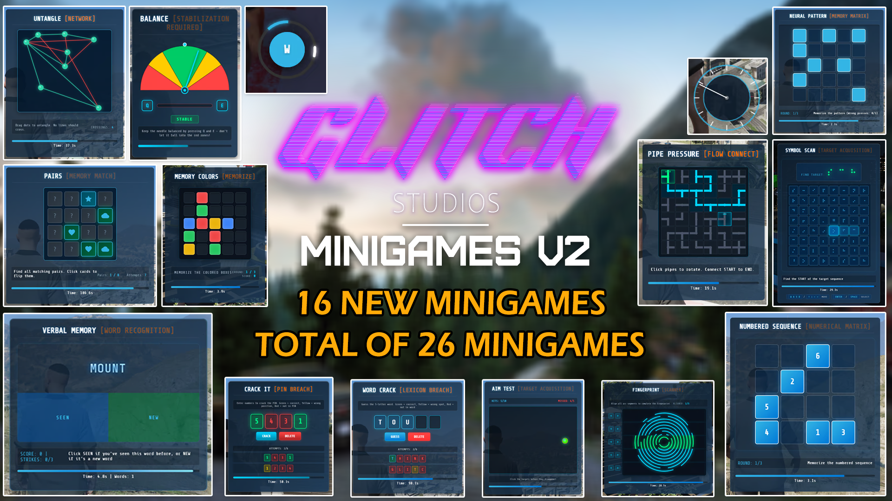

# 🧩 Glitch Minigames


## Now updated to include 16 new minigames as part of Glitch Minigames v2


## Glitch Minigames v2 

<figure><figcaption></figcaption></figure>

<figure><figcaption></figcaption></figure>

Glitch Minigames v1 Video Showcase: [https://youtu.be/NSt7NBNLp2o](https://youtu.be/NSt7NBNLp2o)&#x20;

Glitch Minigames v2 Video Showcase: [https://youtu.be/eLzK9U9jpqo](https://youtu.be/eLzK9U9jpqo)

Github Resource: [https://github.com/Gl1tchStudios/glitch-minigames](https://github.com/Gl1tchStudios/glitch-minigames)

***

### Overview

**Glitch Minigames** is a modular and highly customizable collection of interactive minigames for FiveM servers. Each game is uniquely designed to test player reflexes, timing, memory, and precision. With simple exports for easy integration, audio-visual feedback, and full configuration support, this resource is perfect for enhancing immersion across various gameplay scenarios.

***

### Features

* **Unique Gameplay**: Every minigame offers a distinct experience.
* **Easy Integration**: Trigger minigames with simple exports.
* **Optimized for FiveM**: Designed to run smoothly on any FiveM server.
* **Fully Customizable**: Adjust difficulty parameters to suit your server's needs.
* **Audio Feedback**: Includes sound effects for interactions, success, and failure.

***

### ⭐ Credits

* **Developed by** Luma in collaboration with Glitch Studios

### 💖 Special Thanks

I would like to extend my deepest gratitude to the following individuals and projects for their incredible contributions to the FiveM community. Your hard work, creativity, and dedication have inspired and enabled countless developers, including myself, to create engaging and innovative resources:

* [utkuali](https://github.com/utkuali/datacrack) for the **Data Crack Minigame**, which served as a foundation for one of the games in this resource.
* [BerkieBb](https://github.com/BerkieBb/CircuitBreakerMinigame_lua) and [TimothyDexter](https://github.com/TimothyDexter/FiveM-CircuitBreakerMinigame) for the **Circuit Breaker Minigame**, which provided invaluable insights into precision-based gameplay mechanics.
* [TransitNode](https://github.com/TransitNode/Hacking_PC/tree/master) for their innovative hacking minigame concepts, which inspired several features in this resource.
* [MxttDev](https://github.com/MxttDev/M-drilling) for their **Drilling Minigame**, which laid the groundwork for the drilling mechanics implemented here.
* [SezayK](https://github.com/SezayK/six_atmrobbery/tree/main) for their **Plasma Drilling Minigame**, which laid the groundwork for the plasma drilling mechanics implemented here.

Your contributions have not only enriched the FiveM ecosystem but have also fostered a spirit of collaboration and innovation within the community. Thank you for sharing your work and inspiring others to push the boundaries of what is possible. This resource would not have been possible without your efforts.

***

### 📜 License

This project is licensed under the **GNU General Public License v3.0** - see the LICENSE file for details.

For support or inquiries, please join and open a ticket in our [Discord Server](https://discord.com/invite/PAQX8ANEfw).
