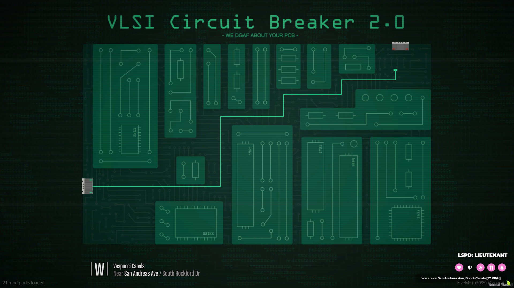
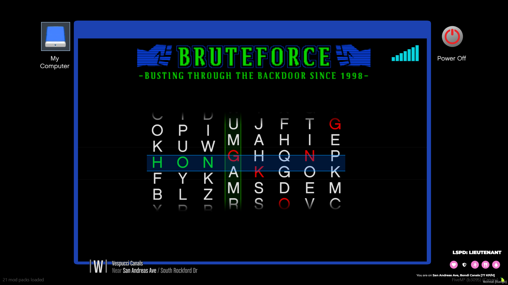
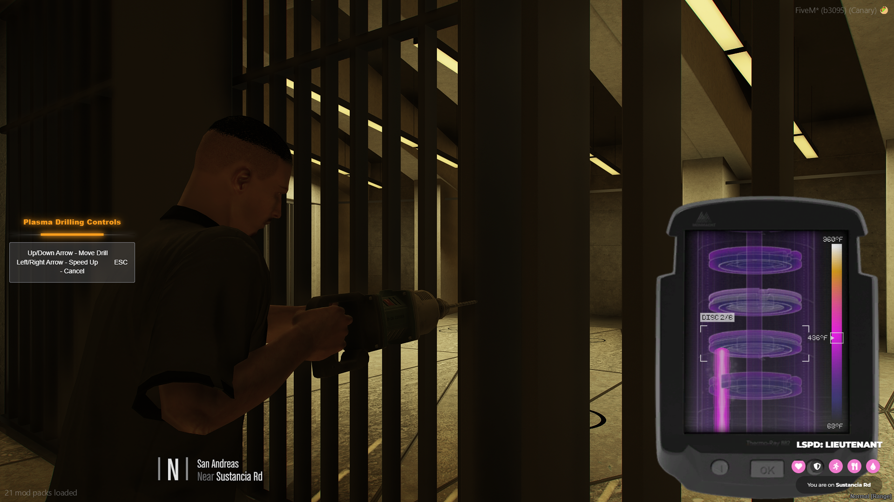

# Examples

### 📚 Usage Examples

Below are quick usage examples for each minigame included in **Glitch Minigames**:

***

<figure><figcaption></figcaption></figure>

#### 🔐 Firewall Pulse

```lua
local success = exports['glitch-minigames']:StartFirewallPulse()
    if success then
        print("You completed the hack!")
    else
        print("You failed the hack")
    end
end)

-- Custom Parameters
local success = exports['glitch-minigames']:StartFirewallPulse(3, 2, 10, 8, 30, 120, 40)
```

***

<figure><figcaption></figcaption></figure>

🧠 Backdoor Sequence

```lua
local success = exports['glitch-minigames']:StartBackdoorSequence(3, 20, 20, 3, 2.0, 3, 6, {'W', 'A', 'S', 'D'}, 'W, A, S, D only')
if success then
    print("Sequence hack successful!")
else
    print("Sequence hack failed!")
end
```

***

<figure><figcaption></figcaption></figure>

#### 🎵 Circuit Rhythm

```lua
local success = exports['glitch-minigames']:StartCircuitRhythm()
    if success then
        print("Rhythm game completed!")
    else
        print("Rhythm game failed")
    end
end)

-- Custom Settings
local success = exports['glitch-minigames']:StartCircuitRhythm(4, {'A','S','D','F'}, 150, 800, 15, "normal", 5, 3)
```

***

<figure><figcaption></figcaption></figure>

#### ⚡ Surge Override

```lua
local success = exports['glitch-minigames']:StartSurgeOverride()
    if success then
        print("Surge Override successful!")
    else
        print("Surge Override failed")
    end
end)

-- Random Key Mode
local success = exports['glitch-minigames']:StartSurgeOverride({'E', 'F'}, 30, 2)
```

***

<figure><figcaption></figcaption></figure>

#### 🔌 Circuit Breaker

```lua
local success = exports['glitch-minigames']:StartCircuitBreaker(2, 1, 0.009, 1500, 2000, 5000, 0.15)
if success then
    print("Circuit successfully breached!")
else
    print("Circuit breach failed!")
end
```

***

<figure><figcaption></figcaption></figure>

#### 📊 Data Crack

```lua
local success = exports['glitch-minigames']:StartDataCrack(3)
if success then
    print("Data successfully cracked!")
else
    print("Failed to crack data!")
end
```

***

<figure><figcaption></figcaption></figure>

#### 🔠 Brute Force

```lua
local success = exports['glitch-minigames']:StartHackConnect(5)
if success then
    print("Password successfully cracked!")
else
    print("Failed to crack password!")
end
```

***

<figure><figcaption></figcaption></figure>

#### 🔢 VAR Hack

```lua
local success = exports['glitch-minigames']:StartVarHack(5, 5)
if success then
    print("VAR hack successful!")
else
    print("VAR hack failed!")
end
```

***

<figure><figcaption></figcaption></figure>

#### 🔥 Plasma Drill

```lua
local success = exports['glitch-minigames']:StartPlasmaDrill()
if success then
    print("Successfully completed plasma drilling!")
else
    print("Plasma drilling failed!")
end

-- Custom Difficulty
local success = exports['glitch-minigames']:StartPlasmaDrill(7)
if success then
    print("Completed difficult plasma drilling!")
else
    print("Failed difficult plasma drilling!")
end
```
