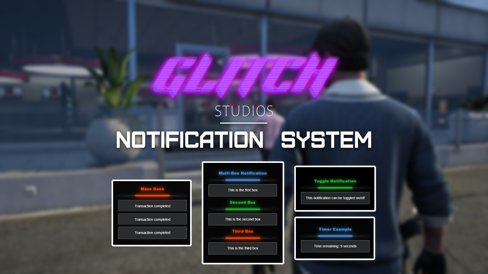

# 🔔 Glitch Notifications

## Glitch Notifications System [](https://www.gnu.org/licenses/gpl-3.0)

<figure><figcaption></figcaption></figure>

Video Showcase: [https://youtu.be/DZlsYaucRYQ](https://youtu.be/DZlsYaucRYQ)

Github Resource: [https://github.com/Gl1tchStudios/glitch-notifications](https://github.com/Gl1tchStudios/glitch-notifications)

### Overview

Glitch Notifications is a dynamic notification system for FiveM, allowing developers to display customizable notifications with titles, dividers, and multiple text boxes. The system supports adding, updating, and removing individual text boxes, as well as toggling notifications on and off.

### Features

* Customizable notifications with titles, dividers, and text boxes.
* Add, update, or remove individual text boxes dynamically.
* Toggle notifications on or off with a single command.
* Support for custom colors and animations.
* Easy integration with FiveM using exports.

**Multiple Notifications Example:**

<div align="left"><figure><figcaption></figcaption></figure></div>

**Coloured Notifications Example:**

<div align="left"><figure><figcaption></figcaption></figure></div>

**Timer Notifications Example:**


### File Structure

```
glitch-notifications
├── client
│   ├── main.lua        # Main client-side script
│   └── ui
│       ├── index.html  # HTML structure for the UI
│       ├── style.css   # Styles for the UI
│       └── script.js   # JavaScript logic for dynamic notifications
├── server
│   └── main.lua        # Main server-side script
├── fxmanifest.lua      # Resource manifest
└── README.md           # Project documentation
```

### 📜 Credits

* **Developed by** Luma in collaboration with Glitch Studios
* **Special thanks** to the FiveM community for support and inspiration

***

### 📜 License

This project is licensed under the **GNU General Public License v3.0** - see the LICENSE file for details.

[](https://www.gnu.org/licenses/gpl-3.0)

For support or inquiries, please join and open a ticket in our [Discord Server](https://discord.com/invite/PAQX8ANEfw).
