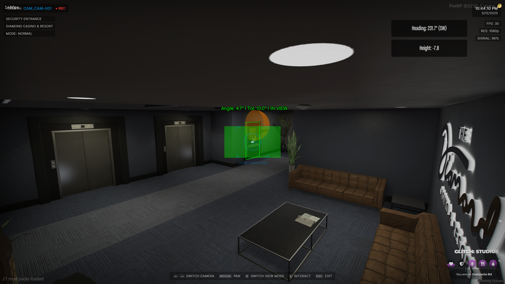

# Configuration

## ⚙️ Config

The following configuration options are available in shared/config.lua:

***

### `config.TestingMode (boolean):`&#xD;

Enable debug commands for testing purposes. Set to false for production.

<figure><figcaption></figcaption></figure>

Using `TestingMode` can help you find values you will need for setting the `rotationLimits`  e.g. You can see the current Heading you are looking at in the top right and the Height.&#x20;

***

### `config.AutoExitEnabled` and `config.AutoExitTime = 300`&#x20;

Both of these two options work with each other. `AutoExitEnabled` will enable the feature to kick the player out of the security cameras after a select amount of second which is defined by `AutoExitTime` .&#x20;

***

### `config.Cameras`

The `config.Cameras` array allows you to set up an advanced security camera system in your scripts.

Each camera configuration includes a unique ID which must be an integer, name, location and hardware features like night vision and thermal modes.&#x20;

You can specify the camera's positional and rotational vectors, as well as rotation limits to restrict its viewing angles. Additionally, each camera can have interactive props associated with it, triggering specific minigame events when interacted with, such as disabling door locks or accessing codes for heists.

The `interactiveProps` field specifies the position, model hash, interaction text, and highlight color, along with parameters for the hack minigame, making this a versatile and customizable setup for simulating sophisticated security operations.&#x20;

```lua
config.Cameras = {
    {
        id = 1,                                                     -- Unique ID for the camera
        name = "Security Entrance",                                 -- Camera name
        location = "Diamond Casino & Resort",                       -- Location of the camera
        modes = { -- both set to true by default
            nightVision = true,
            thermal = true
        },
        position = vector3(2519.4429, -252.3573, -53.3036),         -- Camera position
        rotation = vector3(-10.0, 0.0, 25.0),                       -- Camera rotation
        rotationLimits = {
            x = {min = -75.0, max = -5},                            -- Vertical limits
            z = {min = 89, max = 175.0}                             -- Horizontal limits
        },
        interactiveProps = {
            -- Example using an export for the minigame
            {
                propUniqueId = "security_mainframe",                -- Unique ID for the prop
                position = vector3(2509.0986, -260.3841, -54.0064), -- Prop position
                hash = -1498975473,                                 -- Hash of the prop model
                interactionText = "Disable the Door Locks",         -- Text displayed when interacting with the prop
                successText = "Security system bypassed",           -- Text displayed on success
                failText = "Security alert triggered",              -- Text displayed on failure
                highlightColor = {r = 0, g = 255, b = 0, a = 200},  -- Color of the highlight
                
                hackExport = "glitch-minigames:StartSurgeOverride", -- Export to call for hack minigame
                hackParams = {                                      -- Parameters for the hack minigame
                    keys = {'E', 'F'},
                    requiredPresses = 30,
                    decayRate = 2
                },
            }
        }
    },
}
```

***

## ⬆️ Exports

The following exports are available for use in your scripts:

### Camera Control Exports

#### `EnterCameraMode(cameraIndex, allowed)`

Switches the player's view to a security camera, enabling camera mode and associated UI elements.

| Parameter      | Default     | Description                                                                                           |
| -------------- | ----------- | ----------------------------------------------------------------------------------------------------- |
| cameraIndex    | nil         | The initial camera the player will see when entering the security cameras                             |
| allowedCameras | All Cameras | A table containing the ids of the cameras you want the player to be able to access. e.g. `{1,2,4,5,}` |

#### `ExitCameraMode()`

Returns the player's view to normal and disables camera mode, removing associated UI elements.

* This is handled automatically by the script but can also be used manually

#### `SwitchCamera(cameraIndex)`

Changes the current view to a different security camera by its ID.&#x20;

* This is handled automatically by the script but can also be used manually

| Parameter   | Default | Description                                                               |
| ----------- | ------- | ------------------------------------------------------------------------- |
| cameraIndex | nil     | The initial camera the player will see when entering the security cameras |

#### `AttemptCameraHack(cameraIndex, propId, allowedCameras)`

This will trigger the export you set for HackExport when defining the camera and return true or false in most cases but can also return whatever the export is setup to return.

| Parameter      | Default     | Description                                                                                                                            |
| -------------- | ----------- | -------------------------------------------------------------------------------------------------------------------------------------- |
| cameraIndex    | nil         | The initial camera the player will see when entering the security cameras                                                              |
| propId         | nil         | The prop which the player will be able to hack. This should be the string which is in `propUniqueId` from when you created the camera. |
| allowedCameras | All Cameras | A table containing the ids of the cameras you want the player to be able to access. e.g. `{1,2,4,5,}`                                  |

***

### Camera Management Exports

#### `AddCamera(cameraData)`

Adds a new camera to the security system with specified parameters. CameraData would be like [this](configuration.md#config.cameras)

#### `RemoveCamera(cameraId)`

Removes a camera from the security system by its ID.

#### `GetAllCameras()`

Returns a list of all cameras in the security system.

#### `GetCameraById(cameraId)`

Retrieves a specific camera's data by its ID.

***

## How to set up camera rotationLimits?

To setup the camera rotation limits we must first recognize that the x values are -180 to 180 and the z values are 360 degress. Knowing this we have then included a built-in debug mode which can be toggled on by setting [Config.TestingMode](configuration.md#config.testingmode-boolean) to true. Doing this and then going into a camera will display the current heading and height of where the camera is looking.

<figure><figcaption></figcaption></figure>

By using this information, we can look at where we want the camera rotation limits to be. We then enter the heading/height into rotationLimits and thus lock the cameras view into a certain area.
