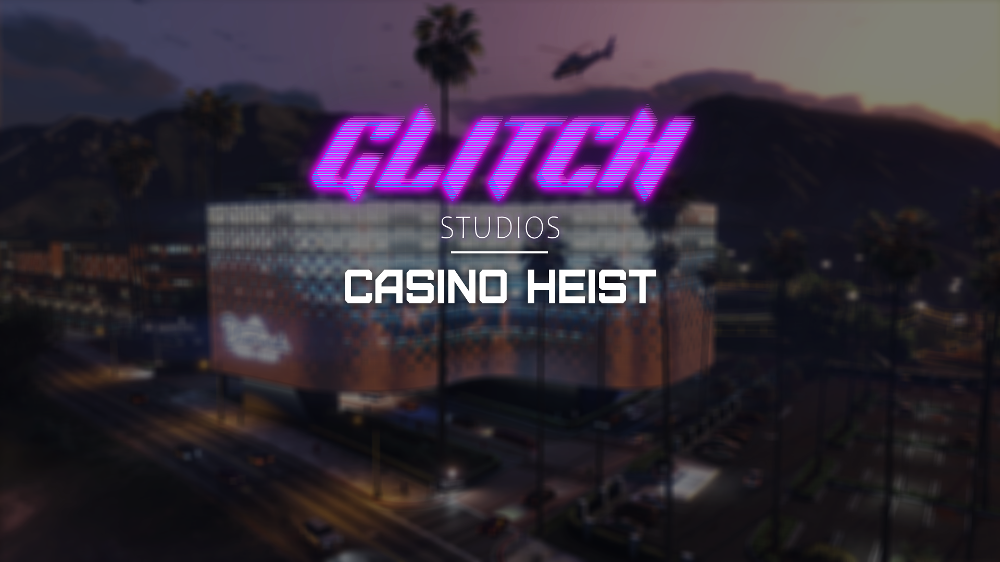

# 🃏 Glitch Casino Heist

### 🎯 What is Glitch Casino Heist?

Glitch Casino Heist is a premium, feature-rich heist resource that transforms your server into an action-packed criminal playground. Players must navigate through 10 detailed stages, from initial reconnaissance to the final vault breach, using a variety of skills including hacking, stealth, explosives, and teamwork.

### 🎬 Preview & Purchase

<figure><figcaption></figcaption></figure>

* **📺 Video Showcase:** View Demo _(Coming Soon)_
* **🛒 Purchase:** Tebex Store _(Coming Soon)_
* **💬 Support:** Discord Server

***

### ✨ Core Features

#### 🎮 **Multi-Stage Heist System**

* **10 Progressive Stages** - Each with unique challenges and objectives
* **Dynamic Progression** - Actions in one stage affect subsequent stages
* **Team Coordination** - Multiple players needed for optimal execution

#### 🔧 **Advanced Hacking System**

* **Multiple Minigame Support** - Compatible with popular hacking resources
* **Progressive Difficulty** - Challenges scale with heist progression
* **Required Items System** - Need specific tools for different hacks
* **Failure Consequences** - Mistakes have realistic impacts

#### 🏢 **Realistic Heist Elements**

* **Power Station Sabotage** - Disable casino power systems
* **Security Camera Networks** - Hack and access surveillance systems
* **USB Collection Mini-Game** - Search 29+ locations for critical data
* **Explosive Planting** - Strategic generator destruction
* **Vault Systems** - Multi-layer security with keycards and codes

#### 🛠️ **Developer Features**

* **Modular Design** - Easy integration with existing frameworks
* **Comprehensive Configuration** - Extensive customization options
* **Event-Driven Architecture** - Clean, maintainable code structure
* **Performance Optimized** - Efficient resource usage

***

### 🎯 Heist Stages Overview

#### **Stage 1-2: Power Infrastructure**

* Infiltrate power station
* Plant explosives on generators
* Create casino-wide blackout

#### **Stage 3-4: Reconnaissance & Access**

* Hack into hacker den systems
* Obtain security codes
* Gather intelligence on vault systems

#### **Stage 5-6: Casino Infiltration**

* Repair casino power selectively
* Access roof maintenance areas
* Breach security camera networks

#### **Stage 7-8: Security Bypass**

* Navigate laser security systems
* Hack computer terminals
* Collect vault keycards

#### **Stage 9-10: Vault Operations**

* Multi-stage vault access
* Advanced security systems
* Final loot collection

***

### 🎮 Key Gameplay Features

#### **🔍 USB Collection System**

* **30 Search Locations** - Trash cans, tables, cabinets, and more
* **Random Spawns** - Different locations each heist
* **Skill-Based Collection** - Minigames required for success
* **Progressive Difficulty** - Later searches are more challenging

#### **💥 Explosive Mechanics**

* **Strategic Placement** - Multiple generator targets
* **Timing Critical** - Coordinate team actions
* **Realistic Animations** - Immersive planting sequences
* **Environmental Impact** - Visible power grid effects

#### **🖥️ Computer Hacking**

* **Multi-Terminal Operations** - Up to 3 simultaneous hacks required
* **Code Fragmentation** - Pieces collected across different systems
* **Access Escalation** - Progressive security clearance levels
* **Network Infiltration** - Realistic corporate security simulation

This is only a small snippet to not spoil the whole heist.

***

### 🛡️ Security Systems

#### **Camera Networks**

* **Surveillance Bypass** - Hack into casino camera systems
* **Vision Modes** - Normal, thermal, and night vision
* **Object Detection** - Identify hackable targets through cameras
* **Real-time Monitoring** - Live security feed access

#### **Electronic Locks**

* **Keypad Systems** - Code-based door access
* **Keycard Readers** - Physical access control
* **Biometric Scanners** - Advanced security measures
* **Backup Systems** - Multiple security layers

***

### ⚙️ Technical Requirements

#### **Dependencies**

* **Glitch Abstraction**

#### **Supported Minigame Systems**

* **Glitch Minigames** - Our in house minigame system. We highly recommend you use this for the best results.
* **SN-Hacking** - Memory games, skill checks
* **glow\_minigames** - Circuit breakers, keypads
* **pure-minigames** - Advanced hacking simulations
* **bd-minigames** - Skill-based challenges
* **boii\_minigames** - Additional challenge types

***

### 🎯 Perfect For

* **🏦 Heist Servers** - The ultimate criminal experience
* **👮 Roleplay Communities** - Complex criminal vs law enforcement scenarios
* **🎮 Action Servers** - High-stakes gameplay with real consequences
* **🏢 Criminal Organizations** - Coordinated group activities

***

### 🏆 Why Choose Glitch Casino Heist?

✅ **10 Detailed Stages** - Most comprehensive heist system available\
✅ 3&#x30;**+ Interactive Locations** - Massive scope and replayability\
✅ **Advanced Security Simulation** - Realistic corporate infiltration\
✅ **Team-Based Gameplay** - Requires coordination and planning\
✅ **Modular Integration** - Works with existing server setups\
✅ **Performance Optimized** - Smooth gameplay experience\
✅ **Active Development** - Regular updates and improvements

***

### 📋 Server Requirements

* **FiveM Server** with latest artifacts
* **Basic scripting knowledge** for customization
* **Team coordination** - Designed for 2-6 players optimal

***

### 🤝 Development Team

**Developed by:** Luma\
**In collaboration with:** Glitch Studios

***

### 📄 License & Legal

> **⚠️ Important:** This is a premium resource. Redistribution or resale is strictly prohibited.

***

### 🚀 Getting Started

Ready to bring the ultimate heist experience to your server?

1. **Purchase** the resource from our Tebex store
2. **Install Dependencies** - Ensure all required resources are running
3. **Configure** - Customize settings in config.lua
4. **Deploy** - Add to server.cfg and restart
5. **Execute** - Gather your crew and plan the perfect heist

**Need help?** Our comprehensive documentation covers everything from basic setup to advanced stage customization.

***

_Transform your server into a criminal playground with Glitch Casino Heist - Where every decision matters and every second counts._
