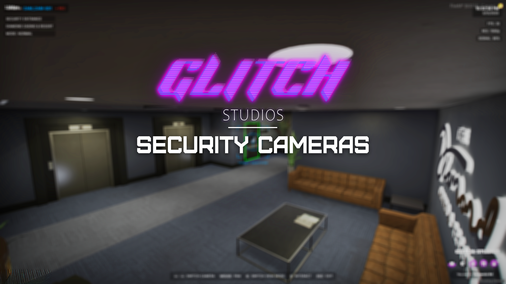

# ⚡ Glitch Electrical Job

## Glitch Electrical Job 

<figure><figcaption></figcaption></figure>

Video Showcase: [https://youtu.be/3O2KEaBLE3Q](https://youtu.be/3O2KEaBLE3Q) \[OUTDATED]

GitHub Resource: [https://github.com/Gl1tchStudios/glitch-electricalJob](https://github.com/Gl1tchStudios/glitch-electricalJob)

***

### Overview

A comprehensive security camera system for your FiveM server. This resource allows players to access, control, and interact with security cameras throughout your server, making it perfect for heist scenarios, security jobs, and more.

***

### Features

* **Five Unique Missions** – Repair various locations and electrical systems.
* **Varied Locations** – Prevents the job from feeling repetitive.
* **Leftover Materials** – Chance to collect extra materials from completed jobs.
* **New Electrical Van** – Special vehicle for employees.
* **Minigames** – Engage in interactive tasks throughout missions.
* **No Job Role Required** – Anyone can start the job without prior roles.

***

### XP System

The XP system enhances job efficiency as players level up:

* **Higher Levels = More Efficiency**
  * More leftover materials from jobs.
  * Faster job completion times.
  * Increased pay per completed task.

***

### ⭐ Credits

* **Developed by** Luma in collaboration with Glitch Studios

***

### 📜 License

This project is licensed under the **GNU General Public License v3.0** - see the LICENSE file for details.

For support or inquiries, please join and open a ticket in our [Discord Server](https://discord.com/invite/PAQX8ANEfw).
